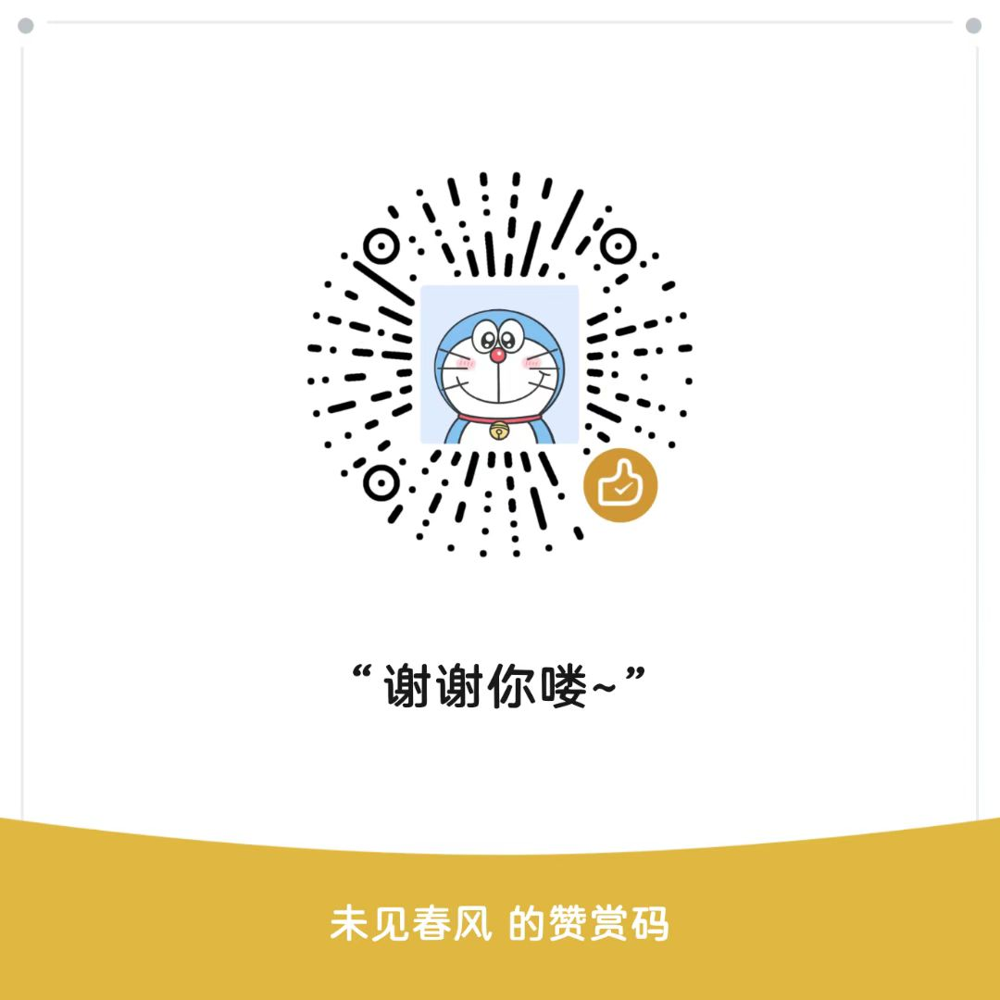

# NewPool - Augment扩展

## 概述

NewPool 是 Augment VS Code 扩展的自定义管理工具，专门用于管理扩展的认证信息和设备配置。它提供了一个用户友好的界面来管理 `accessToken`、`tenantURL` 和设备标识符。

两个修改所用文件可自己研究，或查看https://linux.do/t/topic/819819 来解惑

## 功能特性

### 🔐 认证信息管理
- **获取 accessToken**: 查看当前存储的认证信息
- **设置 accessToken**: 更新认证令牌和租户URL
- **安全存储**: 使用 VS Code 的安全存储机制保护敏感信息

### 🖥️ 设备管理
- **机器码更新**: 重置设备唯一标识符
- **会话管理**: 管理设备会话ID

## 安装

NewPool 功能已集成在 Augment 扩展中，无需单独安装。

https://github.com/xiaoye6688/newpool/releases/tag/newpool-524.1

## 使用方法

### 启动 NewPool

1. 打开 VS Code 命令面板 (`Ctrl+Shift+P` 或 `Cmd+Shift+P`)
2. 输入 `Augment Custom: NewPool`
3. 选择要执行的操作

### 主要功能

#### 1. 获取 accessToken

查看当前存储的认证信息：

- 显示 accessToken（部分隐藏保护隐私）
- 显示 tenantURL
- 支持复制 accessToken 到剪贴板
- 支持查看完整的会话数据

**使用步骤：**
1. 选择 "获取 accessToken"
2. 查看显示的认证信息
3. 可选择复制 accessToken 或查看完整数据

#### 2. 设置 accessToken

更新认证信息，提供两种模式：

**模式一：使用兑换码**
- 快速更新 accessToken
- 使用兑换码一键更新
- 显示当前 token 的部分信息作为参考

**模式二：更新会话数据**
- 同时更新 tenantURL 和 accessToken
- 引导式输入
- 显示当前值作为默认值

**使用步骤：**
1. 选择 "设置 accessToken"
2. 选择更新模式
3. 按提示输入新的认证信息
4. 确认更新

#### 3. 更新机器码

重置设备唯一标识符：

- 生成新的 sessionId
- 更新全局状态
- 提供重载窗口选项

**使用步骤：**
1. 选择 "更新机器码"
2. 确认更新操作
3. 选择是否立即重载窗口

## 赞赏支持

如果你觉得这个项目对你有用，可以请我吃一根五毛钱的阿尔卑斯 😊

### 爱发电支持
https://afdian.com/a/xiaoye6688/plan

### 微信赞赏码

  
  
<em>扫码支持开发者</em>

